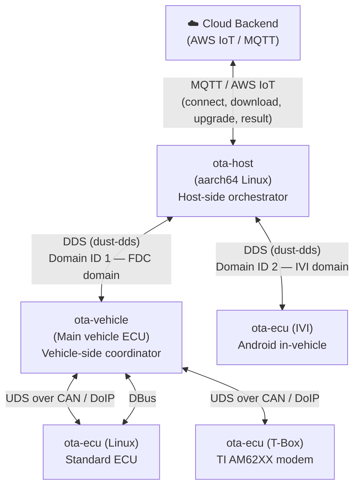

# Architecture

## End-to-End Message Flow



## Component Responsibilities

| Component | Crate | Deployment | Responsibilities |
|---|---|---|---|
| Host orchestrator | `ota-host` | aarch64 Linux | Talks to cloud via MQTT, manages update state machine, coordinates vehicle via DDS, drives DoIP/UDS for remote ECUs |
| Vehicle coordinator | `ota-vehicle` | Main vehicle ECU | Receives update commands from host via DDS, orchestrates local ECUs via UDS/CAN, manages download and flash lifecycle |
| ECU client (Linux) | `ota-ecu` | Per-ECU Linux | Receives and applies firmware updates from vehicle coordinator |
| ECU client (IVI) | `ota-ecu` + `ivi` feature | Android IVI head unit | JNI-based, built via Gradle; communicates with host directly over DDS domain 2 |
| ECU client (T-Box) | `ota-ecu` + `tbox` feature | TI AM62XX 5G modem | Handles modem firmware updates; built for AM62XX target |
| XSUMO adapter | `ota-xsumo` | aarch64 Linux | Bridges XSUMO protocol with FastDDS; built and tested separately |

## DDS Topic Naming Conventions

Topics follow a `ServiceName/direction` pattern:

- **RPC pairs:** `InterfaceName/requ` (request) and `InterfaceName/resp` (response)
- **Domain IDs:** FDC domain = `1`, IVI domain = `2`
- **Type names in use:**
  - `BinaryData` — raw binary payloads for RPC
  - `FDCMessenger::Message` — structured host↔vehicle messages
  - `Messenger::Message` — T-Box structured messages

QoS profiles:
- Binary RPC: Volatile durability, KeepLast(1), Reliable
- Message topics: TransientLocal durability, KeepLast(1), Reliable, up to 20 samples / 10 instances

IDL type definitions: `ota-host/src/dds/idl.rs`

## Update Workflow State Machine

The host-side workflow (in `ota-host/src/workflow.rs`) drives the update lifecycle:

1. **Connect** — authenticate with cloud backend, retrieve ECU update manifest
2. **Download** — retrieve firmware packages from cloud; track per-ECU progress
3. **Upgrade** — signal vehicle coordinator to begin flashing ECUs
4. **Result** — report final status (success/failure per ECU) back to cloud

The vehicle-side state machine (`ota-vehicle`) mirrors this, coordinating the actual UDS flash sequences on the CAN bus.

## Cross-Crate Dependencies

```
ota-host ──depends on──► ota-ecu (default-features = false)
ota-host ──depends on──► ota-utils
ota-host ──depends on──► dust-dds (path dep)
ota-host ──depends on──► srec (path dep)

ota-vehicle ──depends on──► ota-ecu (default-features = false)
ota-vehicle ──depends on──► ota-utils
ota-vehicle ──depends on──► rustdds (workspace)
ota-vehicle ──depends on──► srec (path dep)

ota-utils ──depends on──► cmn-dbc (workspace, kellnr registry)
ota-xsumo ──depends on──► dust-dds + fastdds feature (built separately)
```

Note: `dust-dds` is excluded from the workspace (`exclude = ["lib/dust-dds"]`). It is a path dependency only.
