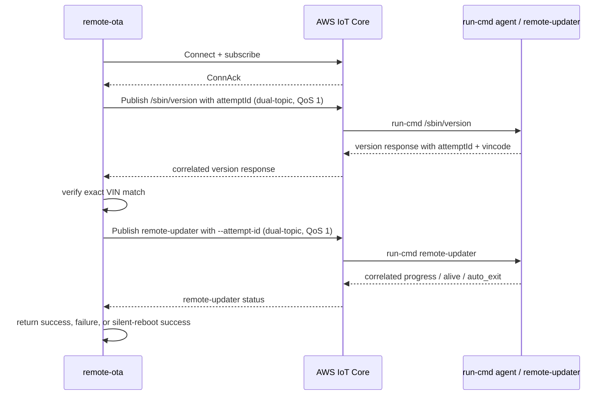
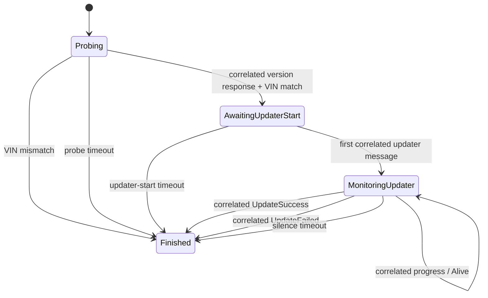
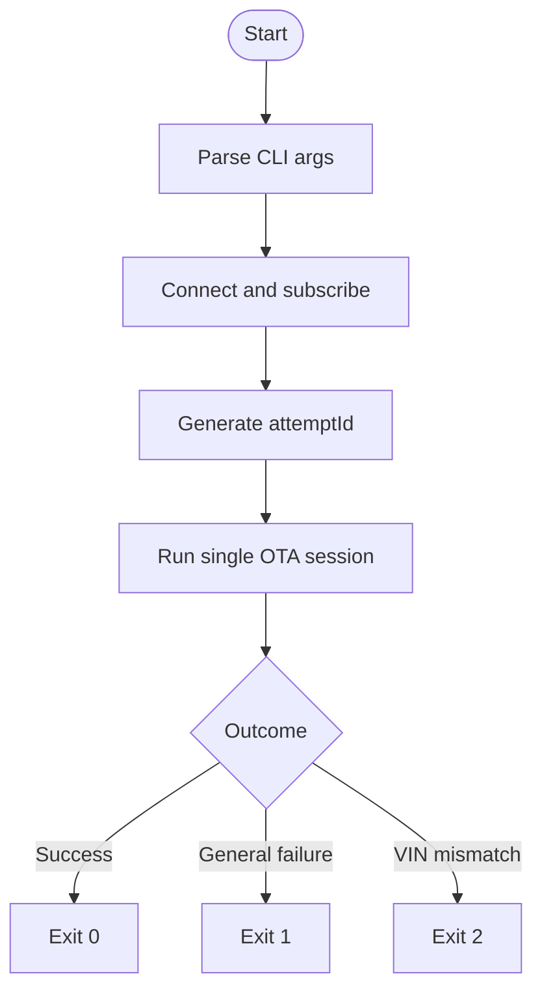

# remote-ota

**Version:** 0.2.0  
**Last Updated:** 2026-04-17  
**Binary:** `remote-ota`  
**Crate:** `remote-ota`

---

## 1. Overview

`remote-ota` is a single-shot Rust program that triggers one OTA firmware update attempt for one FDC vehicle device over AWS IoT Core MQTT. Each invocation performs the full controller flow once:

1. connect to AWS IoT Core over mTLS
2. probe the device with `/sbin/version`
3. verify the returned VIN exactly matches `--vin`
4. launch `remote-updater`
5. monitor correlated updater status until success, failure, or timeout
6. exit with a deterministic process status

This tool no longer exposes the retry-loop controls used by earlier versions.

---

## 2. Design Goals

| ID | Goal | Description |
|---|---|---|
| G1 | Deterministic execution | One invocation performs one OTA attempt and exits |
| G2 | Device safety | Exact VIN matching prevents sending OTA commands to the wrong vehicle |
| G3 | Backward compatibility | Commands are still published to both legacy and IOV run-cmd topics |
| G4 | Message attribution | A controller-generated `attemptId` prevents stale MQTT traffic from satisfying the current attempt |
| G5 | Operator visibility | Structured logging and explicit exit codes make CI and lab usage predictable |

---

## 3. Functional Requirements

### FR-1 Connection Setup

- User must supply Root CA, device certificate, and private key paths.
- Program connects to `data.iot.cloud.foxtronev.com:8883` with TLS 1.2+ mTLS.
- Client ID is supplied by `--client-id`.

### FR-2 VIN Probe

- After connection and subscription setup, the controller publishes `/sbin/version` at QoS 1 to both run-cmd topics.
- The controller starts a fixed 60-second probe timeout after the probe is published.
- Only version responses whose top-level `attemptId` matches the current invocation are considered.
- The `vincode` field must match `--vin` exactly.
- VIN mismatch is fatal and exits with code `2`.

### FR-3 OTA Launch

- On VIN match, the controller publishes the `remote-updater` launch command at QoS 1 to both run-cmd topics.
- The launch command includes SSID, password, auth type, optional `--clean`, and controller-generated `--attempt-id`.
- The controller waits up to 10 seconds for the first correlated `remote-updater` message.

### FR-4 OTA Monitoring

- The controller subscribes to `{sn}/remote-updater/#`.
- The 5-minute silence watchdog starts only after the first correlated updater message arrives.
- Only correlated `remote-updater` messages reset the watchdog.
- Outcome mapping:

| Message characteristics | Outcome |
|------------------------|---------|
| `auto_exit` + `status = Alive` | Keepalive, continue monitoring |
| `auto_exit` + `result = UpdateSuccess` | Exit success |
| `auto_exit` + any other `result` | Exit general failure |
| Silence for 5 minutes after monitoring starts | Exit success, assumed reboot |

### FR-5 Correlation Contract

- Controller generates one opaque `attemptId` per invocation.
- Probe and launch run-cmd requests include that `attemptId` as a top-level JSON field.
- `/sbin/version` responses must echo the same `attemptId`.
- Every `remote-updater` status payload must echo the same `attemptId`.
- Missing or non-matching `attemptId` values are ignored as stale or unrelated traffic.

### FR-6 Exit Codes

| Exit code | Meaning |
|----------|---------|
| `0` | OTA succeeded |
| `1` | General failure: probe timeout, updater failure, session abort, or no correlated updater start |
| `2` | VIN mismatch |

---

## 4. CLI Surface

```
remote-ota [OPTIONS]
```

### Required Arguments

| Flag | Type | Description |
|------|------|-------------|
| `--client-id` | `String` | AWS IoT client ID |
| `--root-ca` | `String` | Path to root CA certificate |
| `--certificate` | `String` | Path to device certificate |
| `--private` | `String` | Path to device private key |
| `--ssid` | `String` | T-BOX Wi-Fi SSID |
| `--password` | `String` | Wi-Fi password |
| `--sn` | `String` | FDC device serial number |
| `--vin` | `String` | Expected vehicle identification number |

### Optional Arguments

| Flag | Type | Default | Description |
|------|------|---------|-------------|
| `--auth` | `u8` | `4` | Wi-Fi authentication type |
| `--timeout` | `u32` | `3600` | Max seconds for `remote-updater` execution on device |
| `--clean` | `bool` | `false` | Clean OTA files and restart OTA service before updating |

### Example

```bash
remote-ota \
    --client-id test-client \
    --root-ca certs/root-ca.pem \
    --certificate certs/device.pem.crt \
    --private certs/private.pem.key \
    --ssid TestWifi \
    --password secret123 \
    --sn SN123456 \
    --vin LSJABCD1234567890 \
    --auth 4 \
    --timeout 3600 \
    --clean
```

---

## 5. MQTT and Protocol Summary

### Published Topics

| Topic | Purpose |
|-------|---------|
| `{sn}` | Legacy run-cmd delivery |
| `{sn}/iov/remote-cmd/sreq/run-cmd/v0` | New-firmware run-cmd delivery |

### Subscribed Topics

| Topic | Purpose |
|-------|---------|
| `{sn}` | Legacy run-cmd responses |
| `{sn}/iov/remote-cmd/vres/run-cmd/v0` | New-firmware run-cmd responses |
| `{sn}/remote-updater/#` | `remote-updater` status and progress messages |
| `{sn}/public/status/online/v0` | Device online status |

### run-cmd Payload Shape

```json
{
    "timestamp": "2026-04-16T08:00:00.000000000Z",
    "attemptId": "SN123456-1713254400000000000",
    "vehicleId": "SN123456",
    "action": "runCmd",
    "data": {
        "command": "remote-updater --ssid 'TestWifi' --password 'secret123' --auth 4 --attempt-id 'SN123456-1713254400000000000'",
        "timeout": 3600
    },
    "message": "AWS IoT console",
    "clientRunCmd": "remote-updater --ssid 'TestWifi' --password 'secret123' --auth 4 --attempt-id 'SN123456-1713254400000000000'",
    "cmdtimeout": 3600
}
```

### Correlated Response Rules

- `/sbin/version` responses must include top-level `attemptId`, `version`, and `vincode`.
- `remote-updater` status payloads must include top-level `attemptId` and `type`.
- Correlation is strict string equality on the top-level `attemptId` field.

---

## 6. Module Responsibilities

### `src/main.rs`

- parse CLI arguments
- initialize `tracing`
- create AWS IoT client and subscribe to required topics
- generate one `attemptId` per invocation
- build probe and launch publish plans
- run exactly one OTA session
- map session outcomes to process exit codes

### `src/session.rs`

- own the per-attempt state machine
- enforce probe, updater-start, and silence timeouts
- accept only correlated version responses and updater status payloads
- return one terminal outcome

### `src/messages.rs`

- build run-cmd payloads
- parse and compare exact `vincode`
- parse and compare exact `attemptId`
- classify `remote-updater` status payloads

### `src/topics.rs`

- construct fixed MQTT topic strings from `sn`

---

## 7. Runtime Flow



---

## 8. Session State Machine



---

## 9. Control Flow



---

## 10. Timeouts and Outcomes

| Phase | Timeout | Result on expiry |
|------|---------|------------------|
| Probe | 60 seconds | general failure |
| Wait for first correlated updater message | 10 seconds | general failure |
| Monitoring silence | 5 minutes | success, assumed reboot |
| Device-side run-cmd execution limit | `--timeout` | device-side termination |

---

## 11. Verification

Project verification commands:

```bash
cargo fmt --all -- --check
cargo clippy --all-targets --all-features -- -D warnings
cargo test
```

---

## 12. Known Limitations

| ID | Item | Status |
|----|------|--------|
| L-1 | Both run-cmd responses and `remote-updater` status payloads must support top-level `attemptId`; mixed old/new rollouts will time out instead of matching stale traffic | Accepted rollout requirement |
| L-2 | The 5-minute silent-reboot path is still an inferred success, not an explicit device confirmation | Accepted product trade-off |
| L-3 | `online_vres` is still subscribed but not yet used for controller decisions | Pending decision |

---

## 13. Environment Requirements

- Rust stable toolchain with `rustfmt` and `clippy`
- reachable `data.iot.cloud.foxtronev.com:8883`
- valid AWS IoT Root CA, device certificate, and private key
- target FDC T-BOX online and subscribed to the required MQTT topics
